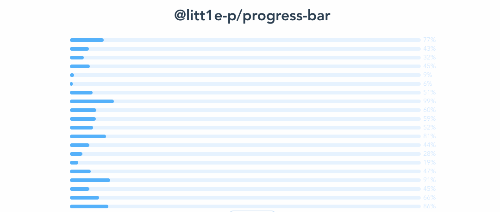

# Introduce

a progress component with count up animation effect for vue

> [vue 2.x supports](https://github.com/litt1e-p/progress-bar)

# Installation

```js
npm i @litt1e-p/progress-bar@next
```

# Usage

1. global component register
  
```js
// in main.js
import ProgressBar from '@litt1e-p/progress-bar'
import '@litt1e-p/progress-bar/dist/progressBar.css'
// or 
@import '@litt1e-p/progress-bar/dist/progressBar.css'

createApp(App).use(Transitions).mount('#app')

<progress-bar :percent="your value"></progress-bar>
```

2. normal component in any vue component

```js
// in any vue component file
import { ProgressBar } from '@litt1e-p/progress-bar'
import '@litt1e-p/progress-bar/dist/progressBar.css'
// or 
@import '@litt1e-p/progress-bar/dist/progressBar.css'

<progress-bar :percent="your value"></progress-bar>
``` 

3. custom tintColor & bgColor
```js
<progress-bar :percent="your value" tintColor="#f0ff0f" bgColor="gray"></progress-bar>
```

# Screenshots


